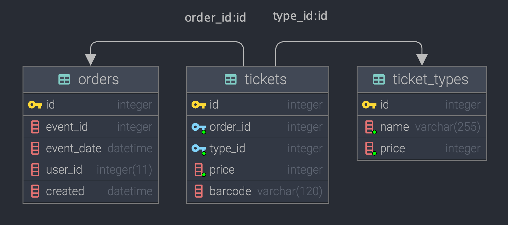

Вариант исполнения тестового задания.

# Задание 1

## Сервис обработки заказов

### Описание
Сервис обработки заказов основан на компонентах [Symfony](https://symfony.com/). В реализации используется база данных `sqlite`. Вызов API осуществляется методами имитаторами. Оценка работы сервиса реализована через `phpunit` тесты.

### Основной принцип работы
Подразумевается, что на вход контроллера `OrderProcessingController` (в тексте задания определен как функция) подается объект класса `Order`, содержащий в свойствах переменные определенные тестовым заданием, а именно `event_id`, `event_date`, `ticket_adult_price`, `ticket_adult_quantity`, `ticket_kid_price`, `ticket_kid_quantity`. В рамках цикла осуществляется:
- генерация баркода с проверкой его уникальности в базе данных сервиса через предсохранение заказа,
- обращение к API с запросом брони с проверкой ответа на наличие ошибок бронирования,
- если баркод уникален в рамках базы и получено подтверждение брони, выполняется запрос на подтверждение брони,
- если в одном из случаев определяется факт не уникальности баркода или ошибки бронирования и количество попыток определенное обработчиком не исчерпано, выполняется повторное его генерирование,
- при отсутствии ошибок бронирования выполняется запрос на подтверждение брони,
- если бронь подтверждена успешно, ранее предсохраненный заказ подтверждается через установку значения поля `created`,
- если бронь не подтверждена, предсохраненный заказ удаляется из базы данных сервиса.

### Важные замечания
Класс `OrderProcessingController`, как и прочие существенные с т.з. сервиса классы, содержит исчерпывающие комментарии по своей структуре.

Метод обработчик формирует и возвращает объект - отчет о выполненных шагах. Дамп отчета можно использовать для более подробного анализа работы сервиса. Вариант дампа отчета в json.
```json
{
  "1": {
    "1": {
      "Title": "Preserve order in database with barcode: 7051636355250958",
      "Result": "orderId: 493"
    },
    "2": {
      "Title": "Make booking API request",
      "Result": "{\"error\":\"barcode already exists\"}"
    }
  },
  "2": {
    "1": {
      "Title": "Update order in database with barcode: 7051636355250939",
      "Result": "orderId: 493"
    },
    "2": {
      "Title": "Make booking API request",
      "Result": "{\"error\":\"barcode already exists\"}"
    }
  },
  "3": {
    "1": {
      "Title": "Update order in database with barcode: 7051636355250577",
      "Result": "orderId: 493"
    },
    "2": {
      "Title": "Make booking API request",
      "Result": "{\"error\":\"barcode already exists\"}"
    }
  },
  "4": {
    "1": {
      "Title": "Update order in database with barcode: 7051636355250916",
      "Result": "orderId: 493"
    },
    "2": {
      "Title": "Make booking API request",
      "Result": "{\"error\":\"barcode already exists\"}"
    }
  },
  "5": {
    "1": {
      "Title": "Update order in database with barcode: 7051636355250706",
      "Result": "orderId: 493"
    },
    "2": {
      "Title": "Make booking API request",
      "Result": "{\"message\":\"order successfully booked\"}"
    },
    "3": {
      "Title": "Make approve API request",
      "Result": "{\"message\":\"order successfully approved\"}"
    },
    "4": {
      "Title": "Processing order in database",
      "Result": "Order stored successfully with barcode: 7051636355250706"
    }
  }
}
```

### Установка
Для установки приложения необходимо выполнить следующую последовательность команд в консоли.
```bash
git clone git@github.com:skodnik/nt_test_task_v3.git
cd nt_test_task_v3
composer install
```

### Оценка работоспособности сервиса
Вызов `__invoke` метода `OrderProcessingController` контроллера осуществляется средствами функциональных тестов реализованных с помощью пакета `phpunit/phpunit`. В рамках тестирования выполняются проверки:
1. инициализация таблиц базы данных: `users` и `orders`, предварительное их наполнение данными из тестового задания,
2. получения полного перечня пользователей и заказов из базы данных сервиса,
3. формирования баркода и его содержания,
4. успешного создания заказа,
5. предсохранения заказа в базе данных сервиса,
6. корректной обработки ошибки сохранения заказа с существующим баркодом,
7. подтверждения заказа в базе данных,
8. бронирования заказа во внешнем сервисе через API,
9. подтверждения заказа во внешнем сервисе через API,
10. алгоритма обработки заказов (в текущей реализации 500 штук) контроллером,
11. формирования отчета процессинга заказа и его методов.

Для запуска тестов необходимо выполнить в консоли.
```bash
./vendor/bin/phpunit
```

Пример вывода результата:
```bash
PHPUnit 9.5.10 by Sebastian Bergmann and contributors.

Runtime:       PHP 8.0.10
Configuration: /Users/vlsv/PhpStormProjects/_tmp/doctrine/phpunit.xml

Api (Tests\Unit\Api)
 ✔ Book order  9 ms
 ✔ Approve order  1 ms

Barcode (Tests\Unit\Barcode)
 ✔ Get new barcode  1 ms

Order Exceptions (Tests\Unit\OrderExceptions)
 ✔ Exception with getId  1 ms
 ✔ Exception with getEventId  1 ms
 ✔ Exception with getEventDate  1 ms
 ✔ Exception with getTicketAdultPrice  1 ms
 ✔ Exception with getTicketAdultQuantity  1 ms
 ✔ Exception with getTicketKidPrice  1 ms
 ✔ Exception with getTicketKidQuantity  1 ms
 ✔ Exception with getBarcode  1 ms
 ✔ Exception with getUserId  1 ms
 ✔ Exception with getEqualPrice  1 ms

Order Processing Report (Tests\Unit\OrderProcessingReport)
 ✔ Create report  1 ms
 ✔ Get exception  1 ms
 ✔ Push  1 ms
 ✔ Get array  1 ms
 ✔ Set status stored  1 ms
 ✔ Set status removed  1 ms
 ✔ Get json  1 ms

Order (Tests\Unit\Order)
 ✔ Order getters  1 ms

User Exceptions (Tests\Unit\UserExceptions)
 ✔ Exception with getId  1 ms
 ✔ Exception with getName  1 ms
 ✔ Exception with getCreated  1 ms

Order Processing Controller (Tests\Feature\OrderProcessingController)
 ✔ Order processing  1469 ms
 ✔ Count stored orders  7 ms

Order (Tests\Feature\Order)
 ✔ Fill orders table  22 ms

User (Tests\Feature\User)
 ✔ Fill users table  16 ms

Time: 00:01.589, Memory: 20.00 MB

OK (28 tests, 538 assertions)

```

## Задание 2
1. Для реализации возможности добавления иных, неопределенных в настоящее время типов билетов, наиболее целесообразно изменить существующую структуру таблицы `orders` исключив столбцы `ticket_adult_price`, `ticket_adult_quantity`, `ticket_kid_price`, `ticket_kid_quantity`, ``equal_price`` и создать таблицы `ticket_types` содержащую идентификатор, именования типов и цену и `tickets` содержащую идентификатор, тип билета и идентификатор заказа как внешний ключ.
2. В дополнение к пункту 1, из таблицы `orders` необходимо перенести поле `barcode` в таблицу `tickets`.

Предлагаемые изменения позволят добавлять новые типы билетов без необходимости корректировки структуры базы данных сервиса. Перенос поля `barcode` в таблицу `tickets` позволит разделить билеты в рамках заказа. Значение финальной стоимости целесообразнее формировать как сумму билетов умноженную на их стоимость в рамках выбранного заказа, а не хранить как статическое значение в базе данных.


### Итоговая структура таблиц



```mysql
CREATE TABLE orders
(
    id INTEGER PRIMARY KEY,
    event_id INTEGER,
    event_date DATETIME,
    user_id INTEGER(11),
    created DATETIME DEFAULT NULL
);
```

```mysql
CREATE TABLE tickets
(
    id INTEGER PRIMARY KEY,
    order_id INTEGER NOT NULL,
    type_id INTEGER NOT NULL,
    price INTEGER NOT NULL,
    barcode VARCHAR(120),
    FOREIGN KEY(order_id) REFERENCES orders(id),
    FOREIGN KEY(type_id) REFERENCES ticket_types(id)
);
```

```mysql
CREATE TABLE  ticket_types
(
    id INTEGER PRIMARY KEY,
    name VARCHAR(255) NOT NULL,
    price INTEGER NOT NULL
);
```